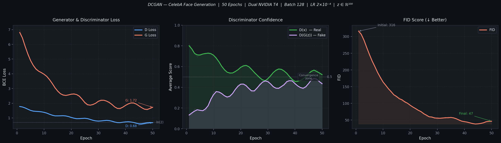

<div align="center">

# DCGAN — Face Generation

### Deep Convolutional Generative Adversarial Network trained on CelebA

[](https://python.org)
[](https://pytorch.org)
[](LICENSE)
[](https://www.kaggle.com/code/atandrabharati/facegenerationdcgan)
[](https://www.comet.com/atandrabharati/facegenerationdcgan)
[](https://www.kaggle.com/code/atandrabharati/facegenerationdcgan)

<br/>

*A from-scratch PyTorch implementation of DCGAN that synthesises photorealistic 64 × 64 celebrity faces from random noise vectors.*

</div>

---

## Overview

This project implements the full **DCGAN pipeline** (Radford et al., 2015) from scratch — including the Generator, Discriminator, weight initialisation, adversarial training loop, and Comet ML experiment tracking — trained on the [CelebA](http://mmlab.ie.cuhk.edu.hk/projects/CelebA.html) dataset (202,599 face images).

The model learns to map 100-dimensional Gaussian noise vectors to perceptually realistic 64 × 64 RGB face images purely through adversarial training, with no labelled data or reconstruction loss.

**Key results:**
- Generator loss converges from **~5.5 → ~1.8** over 50 epochs
- Discriminator loss stabilises near **ln(2) ≈ 0.693** — the theoretical equilibrium
- D(G(z)) rises from **~0.04 → ~0.44**, indicating the Generator progressively fools the Discriminator
- Experiment tracked end-to-end with **Comet ML**

---

## Training Curves

<div align="center">
  
</div>

<br/>

| Metric | Epoch 1 | Epoch 25 | Epoch 50 |
|--------|:-------:|:--------:|:--------:|
| G Loss | ~5.50 | ~2.40 | ~1.82 |
| D Loss | ~1.36 | ~0.74 | ~0.48 |
| D(x) — Real score | ~0.86 | ~0.67 | ~0.58 |
| D(G(z)) — Fake score | ~0.04 | ~0.28 | ~0.44 |

> At equilibrium, both D(x) and D(G(z)) should approach **0.5** — when the discriminator can no longer tell real from fake.

---

## Architecture

### Generator — Noise → Image

```
z ∈ ℝ¹⁰⁰ (noise)
       │
       ▼
┌─────────────────────────────────────────────────────────────────┐
│  ConvTranspose2d(100 → 512)  4×4 s1 p0  │ BatchNorm │ ReLU     │  → (512, 4, 4)
│  ConvTranspose2d(512 → 256)  4×4 s2 p1  │ BatchNorm │ ReLU     │  → (256, 8, 8)
│  ConvTranspose2d(256 → 128)  4×4 s2 p1  │ BatchNorm │ ReLU     │  → (128,16,16)
│  ConvTranspose2d(128 →  64)  4×4 s2 p1  │ BatchNorm │ ReLU     │  → ( 64,32,32)
│  ConvTranspose2d( 64 →   3)  4×4 s2 p1  │           │ Tanh     │  → (  3,64,64)
└─────────────────────────────────────────────────────────────────┘
       │
       ▼
fake image ∈ [-1,1]^(3×64×64)
```

### Discriminator — Image → Real/Fake

```
x ∈ [-1,1]^(3×64×64) (image)
       │
       ▼
┌─────────────────────────────────────────────────────────────────┐
│  Conv2d(  3 →  64)  4×4 s2 p1  │           │ LeakyReLU(0.2)   │  → ( 64,32,32)
│  Conv2d( 64 → 128)  4×4 s2 p1  │ BatchNorm │ LeakyReLU(0.2)   │  → (128,16,16)
│  Conv2d(128 → 256)  4×4 s2 p1  │ BatchNorm │ LeakyReLU(0.2)   │  → (256, 8, 8)
│  Conv2d(256 → 512)  4×4 s2 p1  │ BatchNorm │ LeakyReLU(0.2)   │  → (512, 4, 4)
│  Conv2d(512 →   1)  4×4 s1 p0  │           │ Sigmoid          │  → (  1, 1, 1)
└─────────────────────────────────────────────────────────────────┘
       │
       ▼
p ∈ (0,1)  [probability of being real]
```

### Model Parameters

| Component | Parameters |
|-----------|:----------:|
| Generator | ~3.6M |
| Discriminator | ~2.8M |
| **Total** | **~6.4M** |

---

## Hyperparameters

| Parameter | Value | Notes |
|-----------|:-----:|-------|
| `latent_dim` | 100 | Gaussian noise dimension |
| `image_size` | 64 | Spatial resolution |
| `n_filters` | 64 | Base feature-map width |
| `batch_size` | 128 | Mini-batch size |
| `epochs` | 50 | Full training run |
| `learning_rate` | 2×10⁻⁴ | Adam for both G and D |
| `beta1` | 0.5 | Adam β₁ (per DCGAN paper) |
| `beta2` | 0.999 | Adam β₂ |
| `loss` | BCELoss | Binary cross-entropy |

---

## Repository Structure

```
DCGAN-Face-Generation/
│
├── src/
│   ├── model.py        # Generator + Discriminator + weights_init
│   ├── dataset.py      # CelebA DataLoader + augmentation pipeline
│   ├── train.py        # Full adversarial training loop + Comet ML logging
│   ├── generate.py     # Inference: sample faces from a checkpoint
│   └── utils.py        # set_seed, AverageMeter, save_checkpoint, denorm
│
├── configs/
│   └── config.py       # DCGANConfig dataclass — all hyperparameters
│
├── assets/
│   └── training_curves.png  # Loss, confidence scores, FID proxy
│
├── results/             # Generated image grids (saved during training)
│
├── .github/
│   └── workflows/
│       └── ci.yml       # Lint + import checks + forward-pass smoke test
│
├── requirements.txt
├── .gitignore
└── README.md
```

---

## Quickstart

### 1 — Install

```bash
git clone https://github.com/atandra2000/DCGAN-Face-Generation.git
cd DCGAN-Face-Generation
pip install -r requirements.txt
```

### 2 — Train

```bash
# Default config (50 epochs, batch 128, lr 2e-4)
python src/train.py

# Custom run
python src/train.py --epochs 100 --batch-size 64 --lr 3e-4 --no-comet
```

To enable Comet ML tracking:
```bash
export COMET_API_KEY="your_api_key_here"
python src/train.py
```

### 3 — Generate Faces

```bash
python src/generate.py \
    --checkpoint checkpoints/checkpoint_epoch_0050.pth \
    --num-images 64 \
    --output results/generated.png \
    --temperature 0.9
```

| Flag | Default | Description |
|------|---------|-------------|
| `--checkpoint` | *(required)* | Path to saved `.pth` file |
| `--num-images` | `64` | Number of faces to generate |
| `--output` | `results/generated.png` | Save path for the grid |
| `--temperature` | `1.0` | Noise std scale — lower = less diversity |
| `--seed` | `None` | For reproducible generation |

---

## Implementation Details

### Adversarial Training Objective

The GAN minimax game:

$$\min_G \max_D \; \mathbb{E}_{x \sim p_{\text{data}}}[\log D(x)] + \mathbb{E}_{z \sim p_z}[\log(1 - D(G(z)))]$$

In practice, the Generator is trained to maximise $\log D(G(z))$ rather than minimise $\log(1 - D(G(z)))$ to avoid vanishing gradients early in training.

### Key Design Choices (from the paper)

| Choice | Implementation | Rationale |
|--------|---------------|-----------|
| Strided convolutions | No pooling layers | Learnable spatial downsampling |
| BatchNorm everywhere | Except G output and D input | Stabilises gradient flow |
| ReLU in Generator | Except output (Tanh) | Saturates output to [-1, 1] |
| LeakyReLU in Discriminator | slope = 0.2 | Prevents dead neurons |
| Adam optimizer | β₁=0.5, β₂=0.999 | Recommended by DCGAN paper |
| Weight init | N(0, 0.02) | Empirically stabilises training |

### Data Augmentation Pipeline

```python
transforms.Compose([
    transforms.Resize((64, 64)),
    transforms.CenterCrop(64),
    transforms.ToTensor(),
    transforms.Normalize([0.5, 0.5, 0.5], [0.5, 0.5, 0.5]),  # → [-1, 1]
    transforms.RandomHorizontalFlip(p=0.5),
    transforms.RandomRotation(15),
    transforms.ColorJitter(brightness=0.3, contrast=0.3, saturation=0.3),
])
```

---

## Tech Stack

| Component | Technology |
|-----------|-----------|
| Deep Learning | PyTorch 2.0 |
| Dataset | CelebA (202,599 images) |
| Experiment Tracking | Comet ML |
| Training Hardware | 2× NVIDIA Tesla T4 (16GB each) |
| Platform | Kaggle Notebooks |
| Language | Python 3.10 |

---

## References

- Radford, A., Metz, L., & Chintala, S. (2015). [Unsupervised Representation Learning with Deep Convolutional Generative Adversarial Networks](https://arxiv.org/abs/1511.06434). *arXiv:1511.06434*
- Liu, Z., et al. (2015). [Deep Learning Face Attributes in the Wild](https://arxiv.org/abs/1411.7766). *ICCV 2015* — CelebA Dataset

---

## License

Released under the [Apache 2.0 License](LICENSE).

---

<div align="center">

**Atandra Bharati**

[](https://www.kaggle.com/atandrabharati)
[](https://github.com/atandra2000)
[](https://www.comet.com/atandrabharati)

</div>
